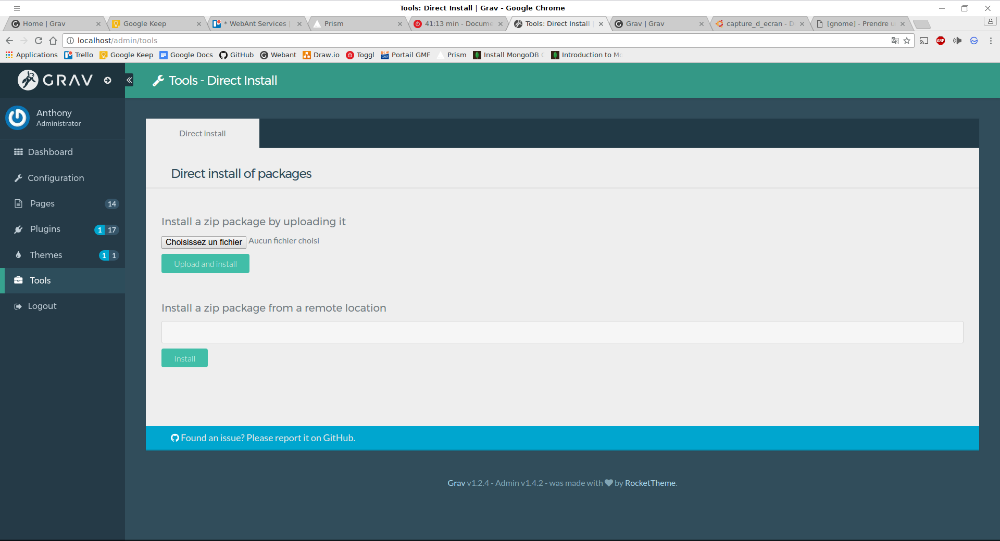

Grav c'est sympa ^^

Pour ne pas galérer voici quelques astuces...

===

### 1. Installation manuelle d'un plugin


Il est posssible d'installer un plugin manuellement sous GRAV. Pour cela, télécharger le ZIP du plugin via le lien de ce dernier. 

Ensuite via la console d'administration, ajouter un plugin via un ZIP dans le menu Tool

```http
http://localhost/admin 	
```

